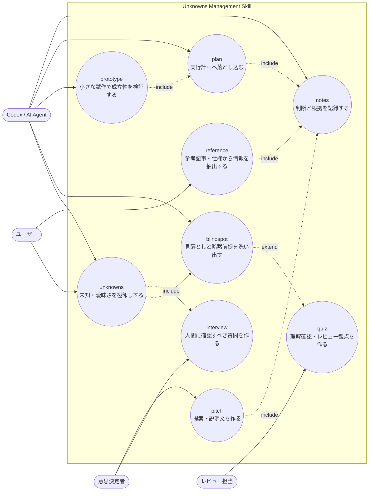
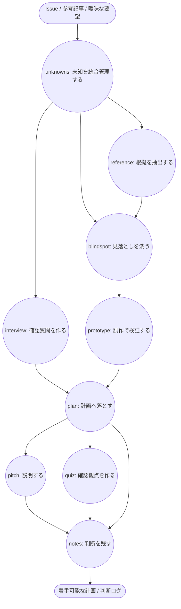

# Unknowns Management Skill ユースケース定義

## 1. 目的

このドキュメントは、`utils/skills` に追加した Unknowns Management Skill 群のユースケースを整理し、実運用で参照できる形に定義する。

対象は次の9スキルである。

| Skill | 役割 |
| --- | --- |
| `unknowns` | 未知・曖昧さ・リスクを統合管理する親スキル |
| `blindspot` | 見落とし、暗黙の前提、破綻条件を洗い出す |
| `prototype` | 不確実性を小さく検証する試作を設計する |
| `interview` | 人間に確認すべき論点を質問へ変換する |
| `reference` | 参考記事・仕様・既存資料から根拠を抽出する |
| `plan` | 調査結果を実行可能な計画へ落とし込む |
| `notes` | 判断、根拠、未決事項を記録する |
| `pitch` | 判断材料や提案を説明可能な形にまとめる |
| `quiz` | 理解確認、レビュー観点、抜け漏れ確認を行う |

## 2. 基本ルーティング

| 状況 | 推奨フロー |
| --- | --- |
| 参考資料がある | `reference` -> `blindspot` -> `plan` -> `notes` |
| 要件が曖昧 | `blindspot` -> `interview` -> `plan` -> `notes` |
| 技術的に成立するか不明 | `reference` -> `prototype` -> `plan` -> `notes` |
| 利害関係者へ説明が必要 | `plan` -> `pitch` -> `quiz` -> `notes` |
| 高リスク変更 | `unknowns` -> `blindspot` -> `reference` -> `interview` -> `prototype` -> `plan` -> `notes` |
| レビュー前の自己点検 | `blindspot` -> `quiz` -> `notes` |

## 3. ユースケース一覧

### 3.0 UMLユースケース図

### 3.1 開発前

| ユースケース | トリガー | 推奨スキル | 主な成果物 |
| --- | --- | --- | --- |
| 新機能の要件定義 | issueやPRDが粗い | `unknowns`, `blindspot`, `interview`, `plan` | 未確定事項、確認質問、実装計画 |
| 既存コードの未知領域調査 | 触る範囲が不明 | `reference`, `blindspot`, `notes` | 関連ファイル、依存関係、注意点 |
| リファクタリング前調査 | 振る舞いを壊す可能性がある | `blindspot`, `reference`, `quiz` | 破壊リスク、テスト観点 |
| API契約変更 | 呼び出し元・呼び出し先が複数ある | `reference`, `blindspot`, `plan` | 影響範囲、移行順序 |
| DBスキーマ変更 | データ互換性が必要 | `blindspot`, `prototype`, `plan` | 移行案、ロールバック条件 |
| 認証・認可追加 | セキュリティ境界が増える | `blindspot`, `interview`, `quiz` | 権限表、悪用ケース、確認項目 |
| 外部API連携 | 仕様変更や障害に弱い | `reference`, `prototype`, `plan` | 仕様要約、失敗時挙動、検証結果 |
| パフォーマンス改善 | ボトルネックが未特定 | `reference`, `prototype`, `plan` | 計測計画、比較結果、採用案 |
| UI/UX新規画面 | 操作期待が曖昧 | `interview`, `prototype`, `pitch` | 画面仮説、確認質問、説明資料 |
| テスト戦略設計 | どこまで検証するか不明 | `blindspot`, `quiz`, `plan` | テスト観点、対象範囲、除外理由 |
| issue分割 | 作業が大きすぎる | `unknowns`, `plan`, `notes` | 独立チケット、依存関係 |
| ADR作成 | 設計判断を残す必要がある | `reference`, `pitch`, `notes` | 選択肢、採用理由、却下理由 |

### 3.2 開発中

| ユースケース | トリガー | 推奨スキル | 主な成果物 |
| --- | --- | --- | --- |
| 実装中に仕様不明点が出た | 判断が必要 | `interview`, `notes`, `plan` | 質問、仮置き方針、更新計画 |
| テスト失敗の原因調査 | 失敗理由が複数あり得る | `blindspot`, `reference`, `prototype` | 仮説、切り分け手順、再現条件 |
| 既存設計と要望が衝突 | どちらを優先するか不明 | `blindspot`, `pitch`, `interview` | トレードオフ、確認質問 |
| スコープ縮小判断 | 時間や複雑度が増えた | `plan`, `pitch`, `notes` | 最小実装案、延期項目 |
| エッジケース発見 | 当初計画にない条件が見つかった | `blindspot`, `quiz`, `notes` | 追加観点、採否判断 |
| 実装方針の変更 | 当初案が成立しない | `prototype`, `plan`, `notes` | 検証結果、新計画 |
| サブエージェント分担 | 調査量が多い | `unknowns`, `plan`, `notes` | 分担表、統合観点 |
| 依存ライブラリ挙動確認 | 仕様やバージョン差が不明 | `reference`, `prototype`, `notes` | 根拠、最小再現、判断 |
| 互換性維持 | 既存利用者への影響がある | `blindspot`, `quiz`, `plan` | 互換性チェック、移行方針 |
| セキュリティ懸念 | 入力、権限、秘密情報が絡む | `blindspot`, `quiz`, `notes` | 脅威観点、対策、残リスク |

### 3.3 開発後

| ユースケース | トリガー | 推奨スキル | 主な成果物 |
| --- | --- | --- | --- |
| PR説明作成 | レビューしやすくしたい | `pitch`, `notes` | 変更理由、確認済み事項 |
| レビュー観点整理 | 見てほしい点を明確にしたい | `quiz`, `blindspot` | レビュー質問、重点箇所 |
| リリース判断 | 出してよいか不安がある | `blindspot`, `quiz`, `pitch` | リスク表、確認結果 |
| QA観点作成 | 手動確認が必要 | `quiz`, `plan` | QAチェックリスト |
| 引き継ぎ | 背景を共有したい | `notes`, `pitch` | 判断ログ、運用注意点 |
| 障害再発防止 | 原因と対策を残す | `blindspot`, `notes`, `quiz` | 再発条件、検知観点 |
| ユーザー向け説明 | 技術詳細を翻訳する | `pitch`, `notes` | 影響説明、利用手順 |
| 振り返り | 次回の改善に使う | `notes`, `quiz` | 学び、未解決事項 |
| ドキュメント同期 | 実装と文書を合わせる | `reference`, `plan`, `notes` | 更新対象、差分理由 |

### 3.4 非開発・横断用途

| ユースケース | トリガー | 推奨スキル | 主な成果物 |
| --- | --- | --- | --- |
| 参考記事の読解 | 記事から実務に使う情報を抜く | `reference`, `notes` | 要点、引用元、適用条件 |
| 競合調査 | 比較軸が曖昧 | `reference`, `blindspot`, `pitch` | 比較表、採用示唆 |
| 運用手順作成 | 作業ミスを防ぎたい | `plan`, `quiz`, `notes` | 手順、確認項目 |
| デザインレビュー | 使い勝手の穴を探す | `blindspot`, `interview`, `quiz` | UXリスク、質問、検証観点 |
| データ分析方針 | 何を見ればよいか不明 | `blindspot`, `prototype`, `plan` | 仮説、集計案、判断基準 |
| プロンプト改善 | 出力品質が安定しない | `blindspot`, `prototype`, `quiz` | 失敗例、改善案、評価基準 |
| AIエージェント委任設計 | 何を任せるか決めたい | `unknowns`, `plan`, `quiz` | 委任範囲、完了条件 |
| ナレッジ化 | 暗黙知を再利用したい | `notes`, `pitch`, `quiz` | 運用知識、確認問題 |

## 4. リスク別運用

### 4.1 低リスク

軽微なドキュメント修正、局所的な調査、既存パターンに沿う小変更で使う。

1. `reference` で根拠を確認する。
2. `notes` で判断と参照元を残す。

### 4.2 中リスク

複数ファイルにまたがる実装、仕様の曖昧さ、レビューで説明が必要な変更で使う。

1. `blindspot` で見落としを洗い出す。
2. `reference` で根拠を抽出する。
3. `interview` で人間に確認すべき点を整理する。
4. `plan` で実行順序を決める。
5. `notes` で判断ログを残す。

### 4.3 高リスク

データ移行、認可、課金、外部公開API、障害復旧、不可逆変更で使う。

1. `unknowns` で全体を統合管理する。
2. `blindspot` で破綻条件を広く探す。
3. `reference` で一次情報を抽出する。
4. `interview` で未決定事項を人間へ確認する。
5. `prototype` で成立性を検証する。
6. `plan` で段階的な実行計画にする。
7. `pitch` で意思決定者へ説明する。
8. `quiz` でレビュー観点を作る。
9. `notes` で判断、残リスク、次回参照先を残す。

## 5. スキル別ユースケース

### 5.1 `unknowns`

| ユースケース | 使う場面 | 出力 |
| --- | --- | --- |
| 不確実性の棚卸し | 要件、技術、運用、期限のどれが危ないか不明 | 未知リスト、優先順位 |
| 作業開始前のリスク分類 | issueに着手する直前 | 低/中/高リスク判定 |
| 複数スキルの司令塔 | 調査、質問、試作、計画が全部必要 | 実行順序、委任方針 |
| 判断待ちの整理 | 人間確認が必要な論点が散らばっている | 決めるべきこと一覧 |
| サブエージェント利用計画 | 複数観点を並列調査したい | 分担、統合観点 |
| スコープ確定 | どこまで今回やるか曖昧 | 今回やること、やらないこと |
| 高リスク変更の着手判定 | データ、権限、外部公開APIに触る | 必須確認、停止条件 |

### 5.2 `blindspot`

| ユースケース | 使う場面 | 出力 |
| --- | --- | --- |
| 暗黙前提の洗い出し | 「普通はこう」と思っている箇所がある | 前提リスト、検証方法 |
| エッジケース探索 | 入力、状態、権限、時刻、並行実行が絡む | 破綻条件、追加テスト |
| レビュー前の抜け漏れ確認 | PR作成前 | レビュー観点 |
| セキュリティ観点の確認 | ユーザー入力、秘密情報、権限を扱う | 悪用ケース、対策 |
| 互換性確認 | 既存ユーザーや既存データに影響する | 影響範囲、移行リスク |
| 障害再発防止 | 原因が一つに見えている | 別原因、再発条件 |
| UI操作の見落とし確認 | キーボード、モバイル、空状態がある | 操作不能パターン |

### 5.3 `prototype`

| ユースケース | 使う場面 | 出力 |
| --- | --- | --- |
| 技術成立性の検証 | API、ライブラリ、性能が不明 | 最小検証結果 |
| パフォーマンス仮説検証 | 改善案が本当に効くか不明 | 計測条件、比較結果 |
| データ移行の試算 | 既存データで壊れないか不明 | サンプル移行結果 |
| UI操作感の確認 | 仕様だけでは使いやすさが判断できない | 試作案、観察ポイント |
| 外部API挙動確認 | 仕様書だけでは例外時挙動が読めない | 成功/失敗パターン |
| プロンプト改善検証 | 出力品質の差を見たい | 比較プロンプト、評価基準 |
| アーキテクチャ選定 | 複数案のコスト差が不明 | 小さな実装比較 |

### 5.4 `interview`

| ユースケース | 使う場面 | 出力 |
| --- | --- | --- |
| 要件確認 | 仕様が複数解釈できる | 質問リスト |
| 優先順位確認 | スコープを削る必要がある | 選択肢、推奨案 |
| 例外時挙動確認 | エラー、空状態、権限不足の扱いが未定 | 決定待ち項目 |
| UX期待確認 | ユーザーが何を自然と期待するか不明 | 確認質問 |
| 運用制約確認 | 手順、権限、監視、復旧が絡む | 運用質問 |
| 成功条件確認 | 何をもって完了か曖昧 | 受け入れ条件案 |
| 非機能要件確認 | 性能、セキュリティ、可用性が未定 | 非機能質問 |

### 5.5 `reference`

| ユースケース | 使う場面 | 出力 |
| --- | --- | --- |
| 参考記事の要点抽出 | 記事から実装に使う情報を抜きたい | 要点、適用条件 |
| 公式仕様の確認 | ライブラリやAPIの挙動が不明 | 根拠、制約 |
| 既存ドキュメント読解 | 要件、設計、ADRを読み込む | 決定済み事項 |
| 競合・類似事例調査 | 実装案の妥当性を比較したい | 比較軸、示唆 |
| 法務・規約確認 | 利用条件や制約が関わる | 守るべき条件 |
| エラーメッセージ調査 | 原因候補を資料から探す | 原因仮説 |
| 過去issue調査 | 同じ判断が過去にないか見る | 過去判断、差分 |

### 5.6 `plan`

| ユースケース | 使う場面 | 出力 |
| --- | --- | --- |
| 実装計画作成 | 調査結果を作業順にしたい | ステップ、検証 |
| issue分割 | 作業が大きすぎる | 独立チケット |
| リリース計画 | 段階的に出したい | フェーズ、ロールバック |
| テスト計画 | どの検証を実施するか決めたい | テスト観点 |
| 移行計画 | データやAPI互換性がある | 移行順序 |
| サブエージェント計画 | 並列に進めたい | 担当、統合方法 |
| スコープ調整 | 時間内に収めたい | 最小実装、延期項目 |

### 5.7 `notes`

| ユースケース | 使う場面 | 出力 |
| --- | --- | --- |
| 判断ログ保存 | なぜその方針にしたか残したい | 決定、根拠、代替案 |
| 未決事項管理 | 後で確認する項目がある | TODO、保留理由 |
| 調査メモ整理 | 参考情報が散らばる | 要約、リンク |
| レビュー結果記録 | 指摘と対応を追いたい | 指摘、対応、残課題 |
| 引き継ぎ | 背景を短く共有したい | 作業履歴、注意点 |
| 障害対応記録 | 原因と対策を残す | 時系列、再発防止 |
| スキル改善メモ | 使ってみた課題を残す | 改善候補 |

### 5.8 `pitch`

| ユースケース | 使う場面 | 出力 |
| --- | --- | --- |
| 技術案の説明 | なぜこの案か伝えたい | 提案文 |
| PR説明 | レビューしやすくしたい | 変更理由、確認結果 |
| リスク説明 | 残リスクを合意したい | リスク、対策、判断依頼 |
| スコープ交渉 | 何を削るか説明したい | 選択肢、影響 |
| ユーザー向け説明 | 技術詳細をわかりやすくしたい | 利用者向け文面 |
| ADR草案 | 設計判断を文書化したい | 背景、決定、結果 |
| 障害報告 | 事実と対策を整理したい | 報告文、再発防止 |

### 5.9 `quiz`

| ユースケース | 使う場面 | 出力 |
| --- | --- | --- |
| 理解確認 | 読んだ内容を身につけたい | 確認問題 |
| レビュー観点生成 | 見るべき点を漏らしたくない | チェックリスト |
| QA項目作成 | 手動検証したい | テスト観点 |
| オンボーディング | 新しい人に知識を渡したい | 学習問題 |
| リリース前確認 | 出してよいか確認したい | 最終チェック |
| 障害再発確認 | 対策が効くか確認したい | 再発防止チェック |
| スキル品質確認 | スキルが要望どおりか見たい | 評価質問 |

## 6. 複合ユースケース

| ユースケース | 推奨スキル順 | 完了条件 |
| --- | --- | --- |
| 参考記事から実装方針を作る | `reference` -> `blindspot` -> `plan` -> `notes` | 根拠付きの実装計画がある |
| 曖昧なissueを着手可能にする | `unknowns` -> `interview` -> `plan` | 確認質問と作業分解がある |
| 高リスク変更を安全に進める | `unknowns` -> `blindspot` -> `prototype` -> `plan` -> `quiz` | 検証結果、停止条件、テスト観点がある |
| PR前に自己レビューする | `blindspot` -> `quiz` -> `pitch` | 抜け漏れ確認と説明文がある |
| 障害対応を再発防止へつなげる | `reference` -> `blindspot` -> `notes` -> `quiz` | 原因、対策、再発確認がある |
| スキル自体を改善する | `unknowns` -> `quiz` -> `notes` -> `plan` | 要望との差分と改善計画がある |
| 人間の判断を最短で引き出す | `blindspot` -> `interview` -> `pitch` | 選択肢と影響が明確な質問がある |
| 複数サブエージェントで調査する | `unknowns` -> `plan` -> `reference` -> `notes` | 分担結果が統合されている |

## 7. 運用上の注意

- このドキュメントはユースケース整理の補助資料であり、Skill の正本ではない。
- スキル本文の手順を変更する場合は `utils/skills/*/SKILL.md` を更新する。
- README はカタログとして扱い、詳細な運用判断はこのドキュメントまたは各 `SKILL.md` に集約する。
- ユースケースが増えた場合は、このドキュメントに追加し、必要に応じて各 `SKILL.md` の `When to Use` へ反映する。
